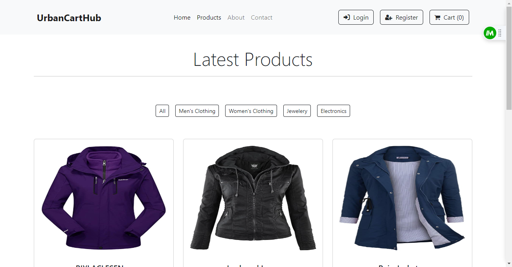

# E-Commerce Website

A Ecommerce Website made with React.js Framework.

With a commitment to simplicity and a sleek design, our React-based e-commerce project places a premium on enhancing user experience. Our platform is thoughtfully crafted to streamline the shopping process, ensuring customers can effortlessly discover and acquire the products they desire.

## Demo

https://react-ecommerce-dusky.vercel.app/

## Features

- Easy to integrate with Backend
- Fully Responsive


## Screenshots





## Run Locally

Clone the project

```bash
  git clone https://github.com/ssahibsingh/React_E-Commerce
```

Go to the project directory

```bash
  cd React_E-Commerce
```

Install dependencies

```bash
  npm install
```

Start the server

```bash
  npm start
```


## Tech Stack

* [React](https://reactjs.org/)
* [Redux](https://redux.js.org/)
* [Bootstrap](https://getbootstrap.com/)
* [Fake Store API](https://fakestoreapi.com/)

## Contributing

Contributions are always welcome!
Just raise an issue, we will discuss it.


